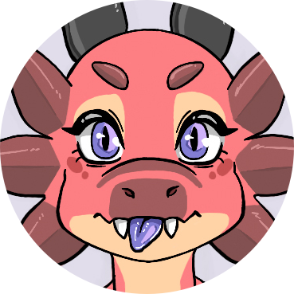
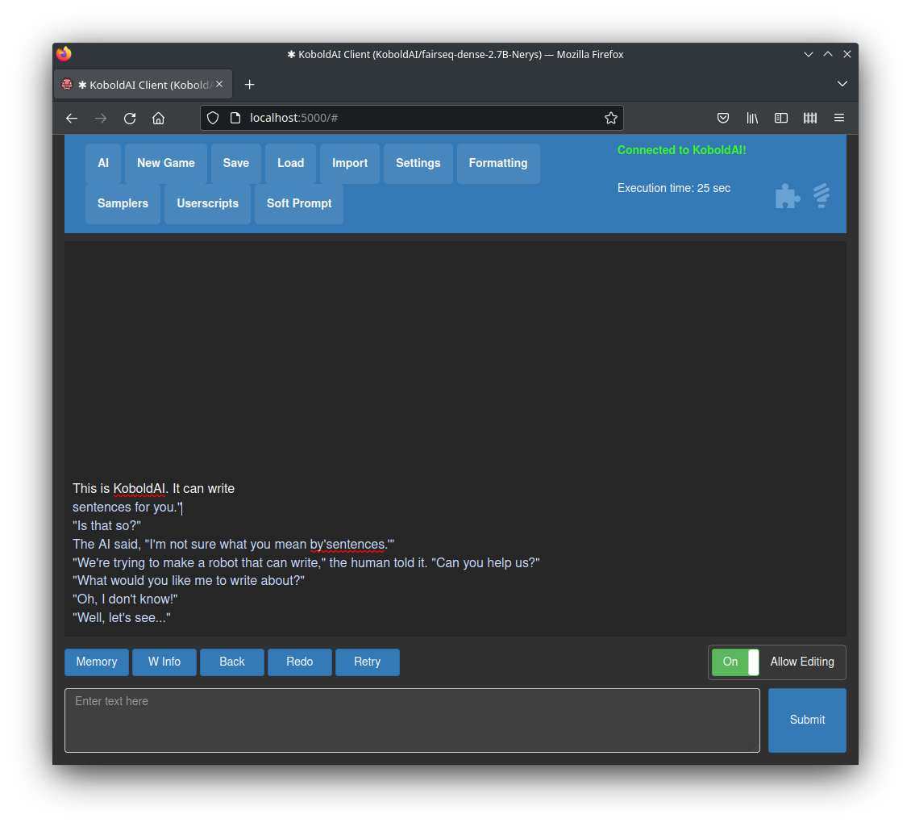

<h1 align="center">KoboldAI</h1>

<b>Your gateway to GPT writing</b>

  This is a browser-based front-end for AI-assisted writing with multiple local & remote AI models. It offers the
  standard array of tools, including Memory, Author's Note, World Info, Save & Load, adjustable AI settings, formatting
  options, and the ability to import existing AI Dungeon adventures. You can also turn on Adventure mode and play the
  game like AI Dungeon Unleashed.

<a href="docs/installation.md">Installation</a> - <a href="docs/usage.md">Usage</a> - <a href="#Contributors">Contributors</a> - <a href="#License">License</a>

  

## Contributors

This project contains work from the following contributors :

*   The Gantian - Creator of KoboldAI, has created most features such as the interface, the different AI model / API integrations and in general the largest part of the project.
*   VE FORBRYDERNE - Contributed many features such as the Editing overhaul, Adventure Mode, expansions to the world info section, breakmodel integration, scripting support, API, softpromtps and much more. As well as vastly improving the TPU compatibility and integrating external code into KoboldAI so we could use official versions of Transformers with virtually no downsides.
*   Henk717 - Contributed the installation scripts, this readme, random story generator, the docker scripts, the foundation for the commandline interface and other smaller changes as well as integrating multiple parts of the code of different forks to unite it all. He also optimized the model loading so that downloaded models get converted to efficient offline models and that in future models are more likely to work out of the box. Not all code Github attributes to Henk717 is by Henk717 as some of it has been integrations of other people's work. We try to clarify this in the contributors list as much as we can.
*   Ebolam - Automatic Saving, back/redo, pinning, web loading of models
*   one-some, Logits Viewer and Token Streaming
*   db0, KoboldAI Horde
*   Frogging101 - top\_k / tfs support (Part of this support was later redone by VE to integrate what was originally inside of finetuneanon's transformers)
*   UWUplus (Ralf) - Contributed storage systems for community colabs, as well as cleaning up and integrating the website dependencies/code better. He is also the maintainer of flask-cloudflared which we use to generate the cloudflare links.
*   Javalar - Initial Performance increases on the story\_refresh
*   LexSong - Initial environment file adaptation for conda that served as a basis for the install\_requirements.bat overhaul.
*   Arrmansa - Breakmodel support for other projects that served as a basis for VE FORBRYDERNE's integration.
*   Jojorne - Small improvements to the response selection for gens per action.
*   OccultSage (GooseAI) - Improved support for GooseAI/OpenAI

As well as various Model creators who will be listed near their models, and all the testers who helped make this possible!

Did we miss your contribution? Feel free to issue a commit adding your name to this list.

## License

KoboldAI is licensed with a AGPL license, in short this means that it can be used by anyone for any purpose. However, if you decide to make a publicly available instance your users are entitled to a copy of the source code including all modifications that you have made (which needs to be available trough an interface such as a button on your website), you may also not distribute this project in a form that does not contain the source code (Such as compiling / encrypting the code and distributing this version without also distributing the source code that includes the changes that you made. You are allowed to distribute this in a closed form if you also provide a separate archive with the source code.).

umamba.exe is bundled for convenience because we observed that many of our users had trouble with command line download methods, it is not part of our project and does not fall under the AGPL license. It is licensed under the BSD-3-Clause license. Other files with differing licenses will have a reference or embedded version of this license within the file. It has been sourced from https://anaconda.org/conda-forge/micromamba/files and its source code can be found here : https://github.com/mamba-org/mamba/tree/master/micromamba
